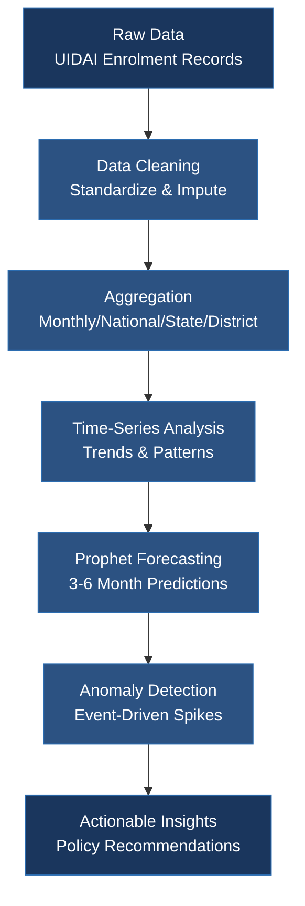
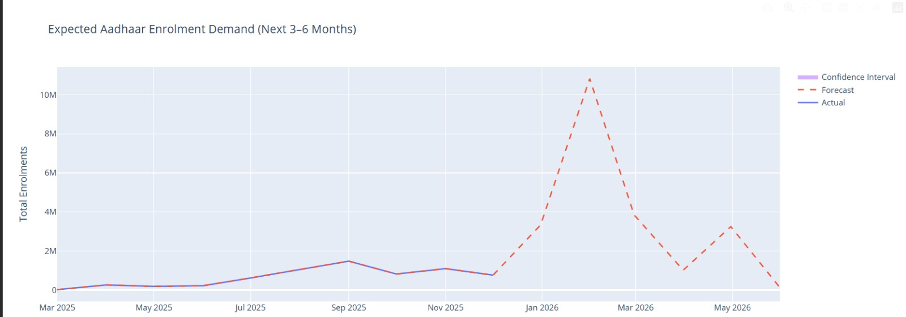
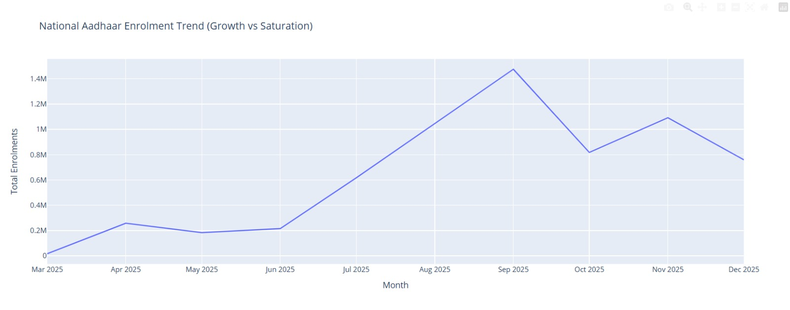
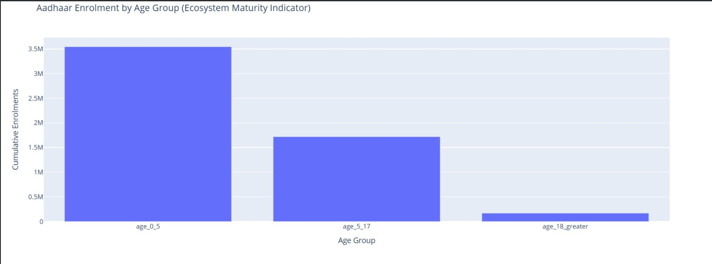
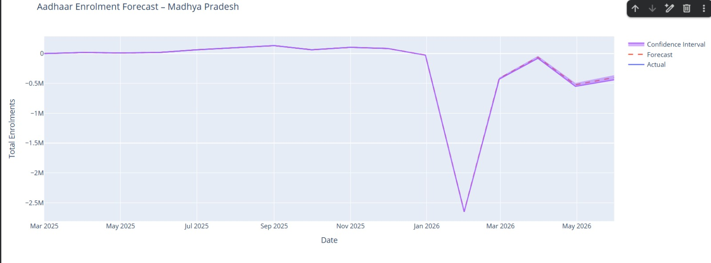
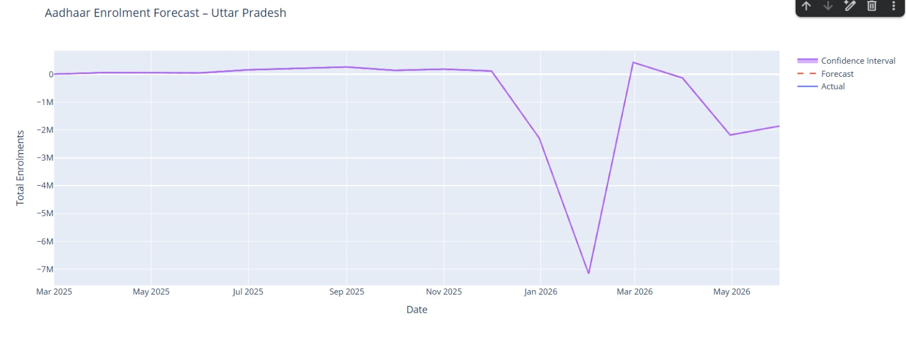
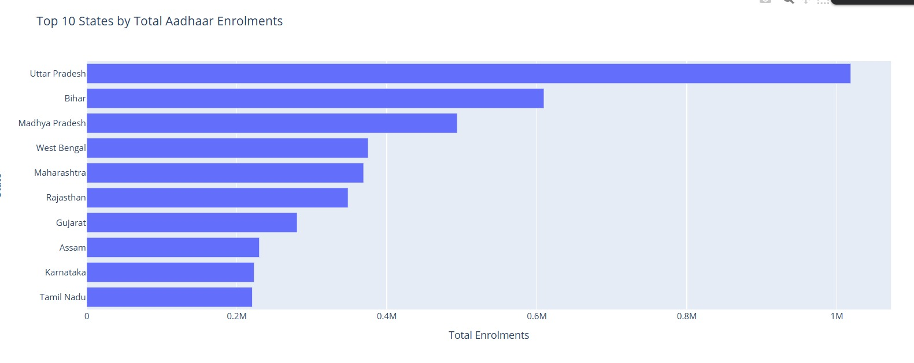
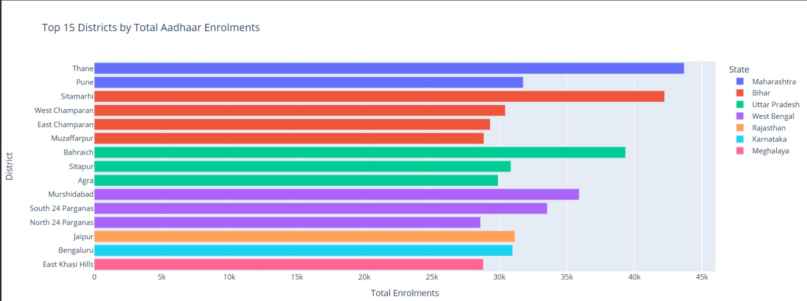
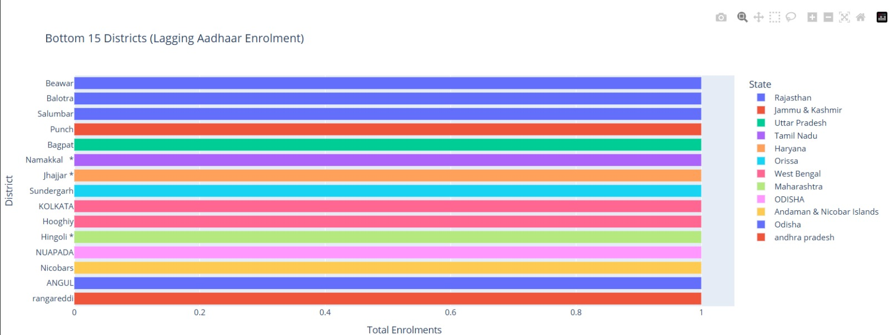
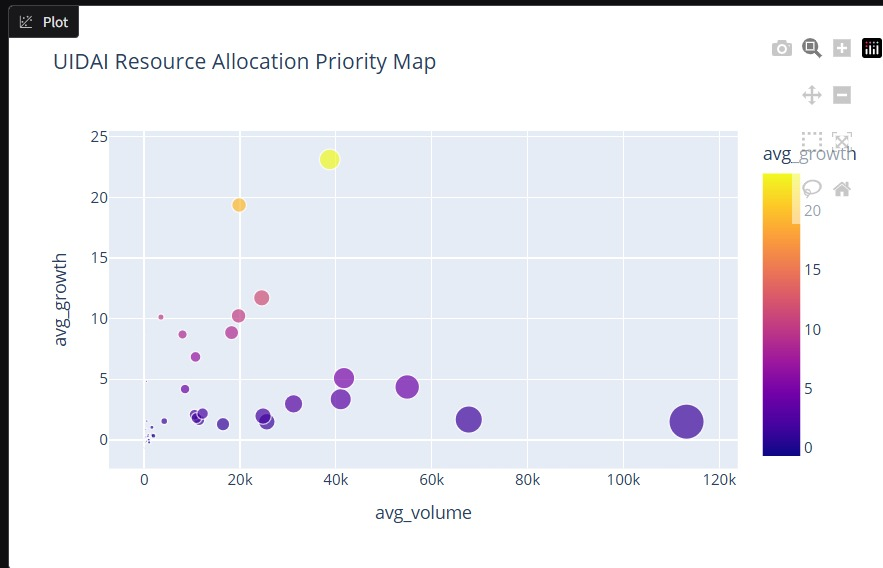

# UIDAI Aadhaar Enrolment Analytics

[](https://uidai.gov.in)
[](https://www.python.org/)
[](https://facebook.github.io/prophet/)
[](https://github.com/prs-24/Aadhaar-Enrolment-Insights)

> **Team GitWolves** - Advanced analytics framework for UIDAI Aadhaar enrolment pattern analysis, trend forecasting, and anomaly detection

---

## 📊 Project Overview

This project transforms UIDAI Aadhaar enrolment data into **actionable intelligence** by identifying patterns, trends, anomalies, and predictive indicators to support informed decision-making and system improvements.

### 🎯 Problem Statement

*"Identify meaningful patterns, trends, anomalies, or predictive indicators and translate them into clear insights or solution frameworks that can support informed decision-making and system improvements."*

### 🏆 Key Achievements

- **Pattern Analysis**: Identified seasonal enrolment trends aligned with fiscal cycles and policy deadlines
- **Trend Forecasting**: Predicted 3-6 month demand using Prophet time-series models
- **Anomaly Detection**: Detected event-driven spikes and operational disruptions
- **Predictive Insights**: Provided state and district-level resource allocation recommendations

---

## 📁 Dataset Description

### Aadhaar Enrolment Dataset
Contains anonymized records of new Aadhaar number generation with the following key columns:

| Column | Description |
|--------|-------------|
| **Enrolment Date** | Date when Aadhaar number was first issued |
| **State** | State where enrolment occurred |
| **District** | Administrative district of enrolment |
| **Pincode** | Local delivery unit |
| **Age Group** | 0-5, 5-17, 18+ |

### Aadhaar Update Dataset
Contains anonymized records of demographic and biometric updates.

### Data Aggregation Levels
- **National Level**: Monthly totals across India
- **State Level**: Monthly totals by state
- **District Level**: Monthly totals by district

---

## 🔬 Analytical Framework



### Methodology Breakdown

<table>
<tr>
<td width="33%" valign="top">

**🔍 Time-Series Analysis**
- Analyzed monthly enrolment trends at national, state, and district levels
- Identified growth phases, saturation signals, and seasonal patterns
- Focused on short-term demand estimation (3-6 months)

</td>
<td width="33%" valign="top">

**📈 Forecasting with Prophet**
- Used Meta's Prophet model for time-series prediction
- Handles seasonality, event-driven spikes, and irregular data
- Provides confidence intervals for risk-aware planning

</td>
<td width="33%" valign="top">

**⚠️ Anomaly Detection**
- Identified sudden spikes and drops in enrolment volumes
- Interpreted using contextual reasoning (policy deadlines, migration cycles)
- Highlights service gaps and policy-driven irregularities

</td>
</tr>
</table>

---

## 🔑 Key Insights

### 🌍 National Level
- **Enrolment Growth**: Sharp rise from June to September 2025, followed by dip in October
- **Seasonality**: Clear monthly patterns with peaks during mid-year and fiscal year-end
- **Early 2026 Surge**: Forecast shows major spike in Jan-Feb 2026 (policy-driven)
- **Saturation Signal**: Post-September decline indicates market maturity

### 🗺️ State Level
**Top Enrolling States:**
- **Uttar Pradesh** - Highest volumes, event-driven demand
- **Bihar** - Sustained growth with recurring demand
- **Madhya Pradesh** - Stable performance, approaching saturation
- **Maharashtra** - Lower, more volatile patterns

**Strategy Implications:**
- UP & Bihar require flexible, surge-based deployment
- Madhya Pradesh needs maintenance-level resources
- Maharashtra shows higher saturation or inconsistent outreach

### 🏙️ District Level
**Top Performers:**
- Urban hubs: Pune, Thane, Bengaluru, Jaipur
- High migration, established infrastructure

**Lagging Districts:**
- Regions: Rajasthan, Odisha, Andaman & Nicobar Islands
- Challenges: Low awareness, limited reach, geographic remoteness

### 👶 Age Group Analysis (Ecosystem Maturity)
| Age Group | Avg. Monthly Enrolments | Contribution |
|-----------|------------------------|--------------|
| 0-5 | 3.5 million | 65.2% |
| 5-17 | 1.7 million | 31.7% |
| 18+ | 168.3k | 3.1% |

**Key Finding**: Low 18+ count reflects system saturation and stability, not disengagement.

---

## 🚀 Tech Stack

<div align="center">

<table>
<tr>
<td align="center" width="200">

<br><br>
<div align="left">
<strong>Python</strong><br>
Core Language
</div>
</td>
<td align="center" width="200">

<br><br>
<div align="left">
<strong>Pandas</strong><br>
Data Analysis
</div>
</td>
<td align="center" width="200">

<br><br>
<div align="left">
<strong>NumPy</strong><br>
Numerical Computing
</div>
</td>
</tr>
<tr>
<td align="center" width="200">

<br><br>
<div align="left">
<strong>Matplotlib</strong><br>
Visualization
</div>
</td>
<td align="center" width="200">

<br><br>
<div align="left">
<strong>Plotly</strong><br>
Interactive Charts
</div>
</td>
<td align="center" width="200">

<br><br>
<div align="left">
<strong>Prophet</strong><br>
Forecasting
</div>
</td>
</tr>
</table>

</div>

### Why Prophet?

**Prophet** is a forecasting model developed by Meta for time-series prediction, designed to handle:

<table>
<tr><td>✅</td><td><strong>Seasonality Detection</strong> - Captures monthly patterns with fiscal cycle alignment</td></tr>
<tr><td>✅</td><td><strong>Irregular Data Handling</strong> - Robust with sparse administrative datasets</td></tr>
<tr><td>✅</td><td><strong>Event-Driven Spikes</strong> - Handles policy-driven surges without treating them as anomalies</td></tr>
<tr><td>✅</td><td><strong>Interpretability</strong> - Decomposable results for policymakers</td></tr>
<tr><td>✅</td><td><strong>Confidence Intervals</strong> - Essential for risk-aware resource planning</td></tr>
<tr><td>✅</td><td><strong>Operational Forecasting</strong> - Optimized for 3-6 month planning horizons</td></tr>
</table>

---

## 📦 Installation & Setup

### Prerequisites
- Python 3.8 or higher
- pip package manager

### Clone Repository
```bash
git clone https://github.com/prs-24/Aadhaar-Enrolment-Insights.git
cd Aadhaar-Enrolment-Insights
```

### Install Dependencies
```bash
pip install -r requirements.txt
```

**Or install manually:**
```bash
pip install pandas numpy prophet plotly matplotlib seaborn jupyter
```

### Run the Analysis
```bash
# Launch Jupyter Notebook
jupyter notebook

# Or run specific analysis scripts
python src/forecasting.py
```

---

## 📈 Project Structure

```
Aadhaar-Enrolment-Insights/
│
├── notebooks/                    # Jupyter notebooks
│
├── src/                         # Python scripts
│
├── data/                        # Raw and processed datasets
│
├── Outputs/
│   └── Graphs/                  # Interactive Plotly HTML outputs
│
├── README.md
├── requirements.txt
├── .gitignore
└── .gitattributes
```

---

## 💡 Key Recommendations

### 🎯 **For UIDAI**

1. **Ecosystem Maturity Shift**
   - Transition from mass acquisition to maintenance phase
   - Focus on update efficiency and inclusion

2. **Seasonal Campaign Timing**
   - Align campaigns with fiscal year deadlines
   - Prepare for Jan-Feb 2026 surge

3. **Migration-Driven Demand**
   - Deploy mobile units in urban hubs (Pune, Thane, Bengaluru, Jaipur)
   - Account for update churn in high-migration areas

4. **District-Level Inclusion**
   - Prioritize Rajasthan, Odisha, Andaman & Nicobar
   - Improve digital infrastructure in lagging districts

5. **Resource Allocation**
   - **Expand**: Rajasthan (23.1% growth) and Tamil Nadu (11.7% growth)
   - **Optimize**: UP (1.5% growth) and Assam (1.5% growth)
   - **Maintain**: Madhya Pradesh (4.3% growth)

---

## 📊 Key Visualizations

### 1. National Enrolment Forecast (Next 3-6 Months)

*Prophet forecast showing predicted spike in Jan-Feb 2026 with confidence intervals*

**Key Observations:**
- Major surge predicted in early 2026 (likely policy-driven)
- Confidence intervals show uncertainty bounds
- Seasonal patterns clearly visible

---

### 2. National Aadhaar Enrolment Trend (Growth vs Saturation)

*Sharp growth from June to September 2025, followed by saturation signals in October*

**Insights:**
- Peak of 1.47M in September 2025
- Drop to ~0.82M in October 2025
- Early signs of market saturation

---

### 3. Age Group Analysis (Ecosystem Maturity Indicator)

*Distribution showing 0-5 age group dominates with 65.2% of total enrolments*

**Maturity Indicators:**
- **0-5**: 3.5M monthly (65.2%) - Strong institutional integration at birth
- **5-17**: 1.7M monthly (31.7%) - Stable school-driven enrolment
- **18+**: 168K monthly (3.1%) - System saturation, not disengagement

---

### 4. State-Level Forecasting
<table>
<tr>
<td width="50%">


**Bihar** - Sustained growth with spike in early 2026

</td>
<td width="50%">


**Madhya Pradesh** - Stable, approaching saturation

</td>
</tr>
<tr>
<td colspan="2" align="center">


**Uttar Pradesh** - High volatility, event-driven demand

</td>
</tr>
</table>

---

### 5. Top Enrolling States

*UP, Bihar, and Madhya Pradesh dominate with high operational capacity*

---

### 6. District-Level Performance
<table>
<tr>
<td width="50%">


**Top Performers**: Urban hubs (Pune, Thane, Bengaluru, Jaipur)

</td>
<td width="50%">


**Lagging Districts**: Remote regions requiring targeted intervention

</td>
</tr>
</table>

---

### 7. Resource Allocation Priority Map

*Scatter plot showing growth rate vs. average monthly enrolments*

**Strategic Priorities:**
- 🔴 **High Priority**: Rajasthan (23.1% growth), Tamil Nadu (11.7% growth)
- 🟡 **Moderate**: Punjab (4.5%), Madhya Pradesh (4.3%)
- 🟢 **Optimize**: UP (1.5%), Assam (1.5%) - shift to maintenance

---

*All visualizations generated using Python, Plotly, and Matplotlib*

---

## 🔍 Anomaly Detection Example

**September 2025 Drop** (1.47M → 0.82M in October):
- **Cause**: Post-deadline normalization, festival slowdowns
- **Context**: Fiscal year-end rush completion
- **Action**: Expected pattern, not a system failure

This sharp decline from September to October 2025 is event-driven rather than structural. September typically coincides with deadlines for Aadhaar-linked welfare schemes, academic admissions, and KYC compliance, creating a temporary surge. Once these deadlines pass, enrolment urgency naturally falls in October.

---

## 👥 Team GitWolves

<table>
  <tr>
    <td align="center">
      <a href="https://github.com/apurvafx">
        
        <br />
        <sub><b>Apurva Sinha</b></sub>
      </a>
      <br />
      <sub>🏆 Project Lead</sub>
      <br />
      <sub>End-to-End Analysis & Implementation</sub>
    </td>
    <td align="center">
      <a href="https://github.com/Aashish-Chandr">
        
        <br />
        <sub><b>Aashish Chandra</b></sub>
      </a>
      <br />
      <sub>Data Analysis & Forecasting</sub>
    </td>
    <td align="center">
      <a href="https://github.com/prs-24">
        
        <br />
        <sub><b>Prateek Raj</b></sub>
      </a>
      <br />
      <sub>Data Processing & Modeling</sub>
    </td>
  </tr>
</table>

---

## 📄 License

This project was developed for the **UIDAI Data Hackathon 2026** and is intended for educational and analytical purposes.

---

## 🙏 Acknowledgments

- **UIDAI** for providing the dataset and problem statement
- **Meta** for the Prophet forecasting library
- **Python Data Science Community** for excellent tools and libraries

---

## 📞 Contact

For questions or collaboration:
- **GitHub Repository**: [Aadhaar-Enrolment-Insights](https://github.com/prs-24/Aadhaar-Enrolment-Insights)
- **Team Members**:
  - [@apurvafx](https://github.com/apurvafx) - Project Lead
  - [@Aashish-Chandr](https://github.com/Aashish-Chandr)
  - [@prs-24](https://github.com/prs-24)

---

**UIDAI Data Hackathon 2026 | Team GitWolves**
